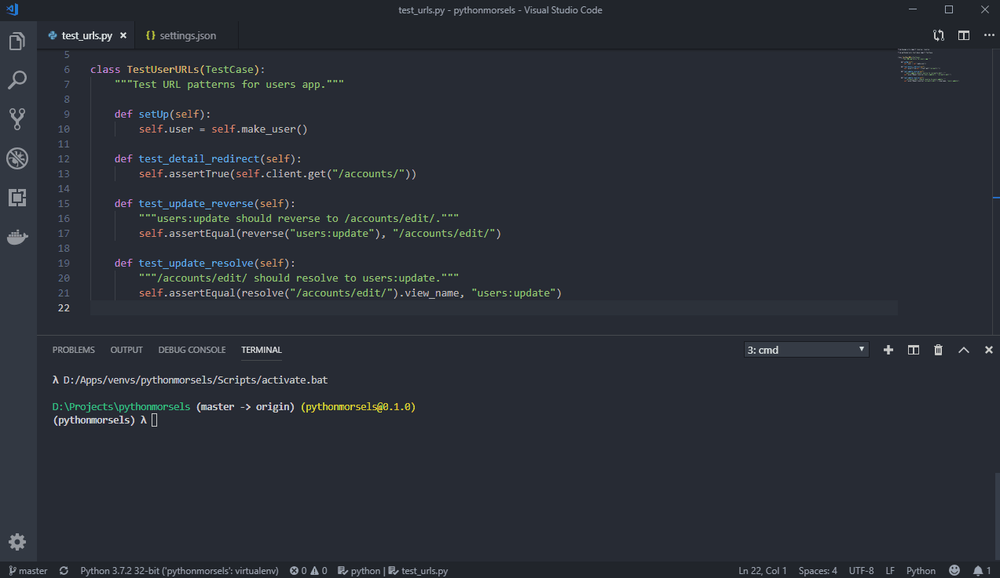

# Terminal Snippets

Are you tired of having to type the same terminal commands over and over again?

**Terminal Snippets** is a [VSCode](https://code.visualstudio.com/) extension that helps you define commands/snippets to be sent to
 the terminal built-in to VSCode.



## Usage

Configure some command snippets in the `terminalSnippets.snippets` setting. A **snippet** is a JSON object with the following properties:

- **name**: The snippet name. This name is going to be displayed in a dropdown list of your snippets so you can recognize it.
- **template**: The snippet/command content. It's called *template* because you can put a `${filename}` in it and it'll be
  substituted with the path of the currently open file in the editor. This is useful if, for example, when you define a command
  to submit the open file to your test runner.
  
### Example

You may define a snippet like this:

```
{
    "name": "test",
    "template": "test-suite --arg1 --arg2 ${filename}"
}
```

- **newTerminal** \[*optional*\]: A **boolean** to indicate whether the snippet should launch in a new terminal tab. By default it runs in the currently active tab or, if there's not one, a new one is opened.
- **pathSep** \[*optional*\]: A **string** the defines the path separator to use when passing the path of the opened file to the snippet. This is useful for me because when I use Windows for development but want to a pass a command with a `${filename}` template in it to Docker with the Linux path separator. By default it uses the current path separator for your system.
- **fileForm** \[*optional*\]: A **string** that defines whether the file path substituted in the snippet will be absolute or relative to your workspace. This is useful, again, in Docker scenarios. By default it's absolute **a**. Use **r** for relative.

Then use the keyboard shortcut <kbd>ALT</kbd>+<kbd>CTRL</kbd>+<kbd>C</kbd> to see a selection of your defined snippets. Select one to use it!

## Other Configuration Options

In addition to the `terminalSnippets.snippets` setting described above, there are some defaults that you may find useful:

- `terminalSnippets.defaultPathSep`: A global default for the `pathSep` property of all your snippets.
- `terminalSnippets.defaultFileForm`: Same for `fileForm` property.

## Contributing

If the extension is not working for you or you have an idea you want implemented, submit an issue or a PR.
